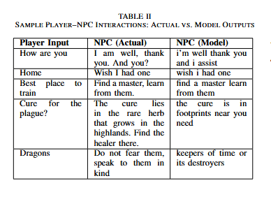
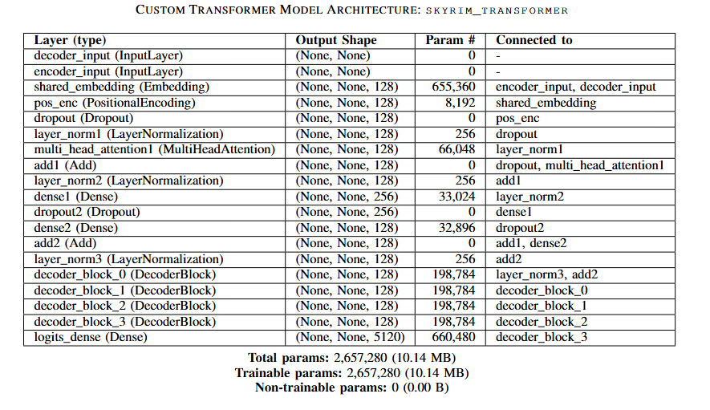
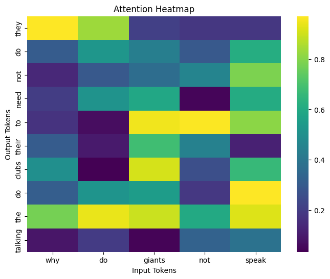
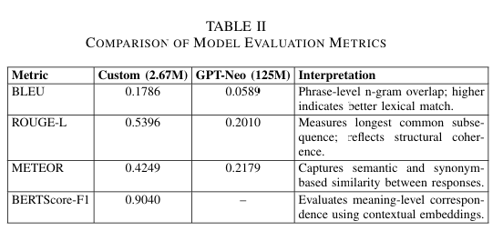
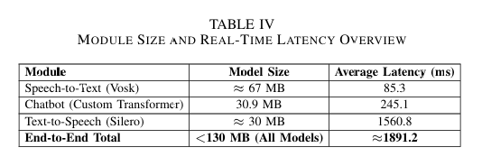

# Sentient_NPC  
## Lightweight Offline Voice-Interactive NPC Dialogue Framework  
<p align="left">     </p>
*A research-oriented, fully offline conversational AI system for immersive games*

---

## Project Motivation

Modern games still rely on **static dialogue trees** or cloud-based AI services for NPC interaction.  
This project demonstrates that **domain-trained, lightweight Transformer models** can enable **real-time, voice-driven NPC conversations entirely offline**, achieving low latency, strong semantic coherence, and lore consistency.

**Sentient_NPC** bridges **AI research** and **game engineering**, making it relevant for:
- Applied Machine Learning / Natural Language Processing roles
- Game AI and simulation research
- Edge AI and on-device inference
- Speech and language systems

---

## Key Contributions

- Designed a **fully offline STT → NLP → TTS pipeline**
- Built a **custom Transformer dialogue model (~2.6M parameters)**
- Trained on **7,565 Skyrim-style NPC–Player dialogue pairs**
- Achieved **BERTScore-F1 ~ 0.90** with **sub-300 ms inference** *(excluding TTS playback)*
- Released the **full training notebook (`training.ipynb`)** for reproducibility

---

## System Architecture

```text
Player Speech
     ↓
Offline Speech-to-Text (Vosk)
     ↓
Transformer-based Dialogue Model
     ↓
Offline Text-to-Speech (Silero)
     ↓
Spoken NPC Response
```

The entire pipeline runs **without internet access**.

---

## Model Overview

- **Architecture:** Encoder–Decoder Transformer  
- **Attention:** Multi-head self-attention + cross-attention  
- **Training:** Teacher forcing with masked loss  
- **Optimizer:** AdamW + warmup cosine decay  
- **Precision:** Mixed precision supported  
- **Inference:** Greedy decoding + Top-k sampling  

**Model Size:** ~30 MB  
**Chatbot Latency:** ~245 ms  

---

## Experimental Results

### Quantitative Metrics

| Metric | Score |
|------|------|
| BLEU | 0.178 |
| ROUGE-L | 0.539 |
| METEOR | 0.424 |
| **BERTScore-F1** | **0.904** |

The compact domain-trained Transformer **outperforms fine-tuned GPT-Neo (125M)** on all metrics.

**Key Insight:** For real-time, offline NPC dialogue, a compact domain-trained Transformer can outperform large general-purpose language models in task relevance, latency, and deployability.

---

## Result Visualizations

> **Report (PDF):**  
> **[Sentient_NPC – AI Voice-Interactive NPC Dialogue Framework](https://github.com/mohanchandrass/Sentient_NPC/blob/main/SentientNPC%20_AI%20Voice-Interactive%20NPC%20Dialogue%C2%A0Framework.pdf)**

### Chatbot Results


### Model Architecture


### Attention Heatmap


### Evaluation Metrics Comparison


### Size Comparison


---

## Explainable AI (XAI)

This project includes:
- Token-level probability inspection
- Attention heatmap visualization
- Decoder confidence analysis

These tools help interpret **why** the model generates a response — useful for research and responsible AI.

---

## Training & Reproducibility

### Training Notebook

`training.ipynb` contains:
- Dataset preprocessing
- Vocabulary construction
- Transformer model definition
- Training loop + callbacks
- Metric computation (BLEU, ROUGE, METEOR, BERTScore)
- XAI experiments

### Quick Start (Colab)

```bash
pip install transformers datasets sacrebleu bert-score tensorflow
```

Open `training.ipynb` and run the cells sequentially.

---

## Repository Structure

```text
Sentient_NPC/
│
├── training.ipynb        # Full research & training pipeline
├── models/               # Saved model checkpoints
├── tokenizers/           # Serialized vocabularies
├── results/              # Plots & figures from report
├── stt/                  # Speech-to-Text (Vosk)
├── tts/                  # Text-to-Speech (Silero)
├── main.py               # End-to-end inference
├── requirements.txt
└── README.md
```

---

## Applications

- Voice-driven NPCs in role-playing games
- Offline conversational agents
- Edge-device AI assistants
- Game AI research and prototyping
- Speech + NLP academic research

---

## Limitations

- Single-turn dialogue *(no memory yet)*
- Domain-specific *(Skyrim-style)*
- TTS playback dominates latency

---

## Future Work

- Multi-turn conversational memory
- NPC personality and emotion control
- Unity / Unreal Engine integration
- Reinforcement learning for adaptive dialogue
- Model compression for mobile and virtual reality
- Multi-language NPC support

---

## Authors

- **Mohan Chandra S S**
- **Mohith R**
- **Nithish Gowda H N**
